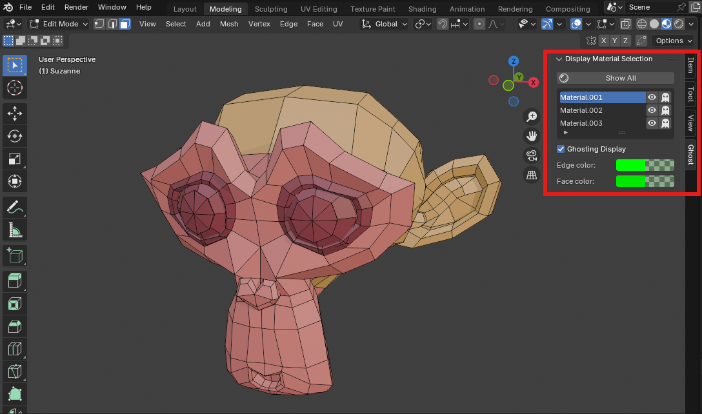
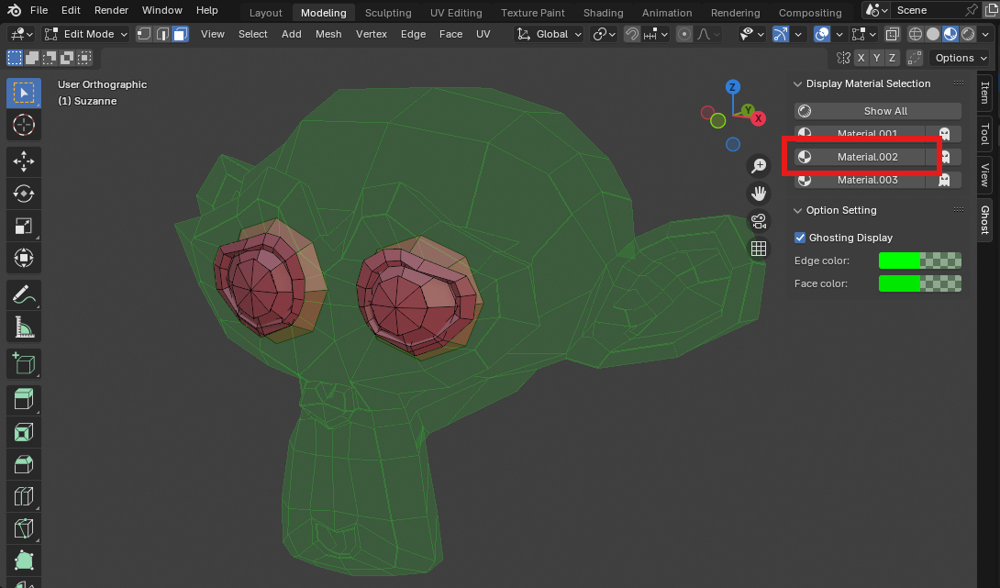
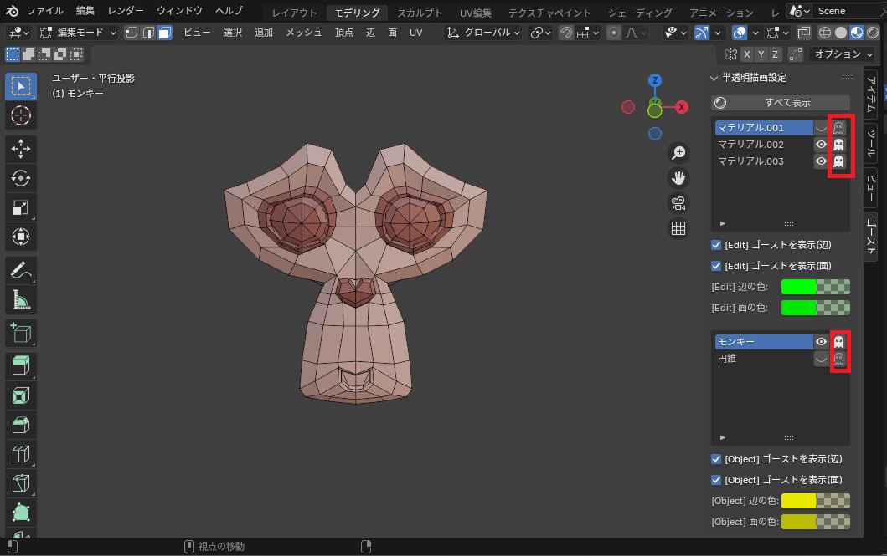

# Blender Add-on: Ghost Mesh

Ghost Meshは編集モードで頂点、辺、面を非表示にした際に、メッシュを半透明で表示するアドオンです。

編集に影響を与えない半透明表示でオブジェクトの形状を確認しながら編集したい人向けのアドオンとなっています。

## インストール

詳細は [INSTALL](docs/INSTALL.md) を確認してください。

## 使用例
編集する際にメッシュの頂点、辺、面が動かないように対象以外を非表示にすることができます。
「表示マテリアルの選択」パネルで編集したいマテリアルのみ表示することができます。

「表示マテリアルの選択」で編集したいメッシュ（Material.002が割り当てられたメッシュ）のボタンをクリックする。

「表示のマテリアル」の右にあるボタン（ゴースト、または×のアイコン）をクリックすることで表示を切り替えます。
※Material.003は半透明（ゴーストのアイコン）でMaterial.001は非表示（×のアイコン）にする。

## 機能

### 表示マテリアルの選択

- 「すべて表示」

  非表示の頂点、辺、面を表示します。

- 「マテリアル」選択

  指定したマテリアルが割り当てられたメッシュのみ表示し、それ以外を半透明（非表示）にします。
  - 「SHIFT」キーを押しながらクリックすることで他のメッシュの非表示状態を維持しながら対象メッシュを表示します。
  - 「CTRL」キーを押しながらクリックすることで他のメッシュの非表示状態を維持しながら対象メッシュを非表示します。

- 「半透明/非表示」切り替え

  マテリアルが割り当てられたメッシュの半透明表示、非表示を切り替えます。

### オプション設定

- 「ゴーストを表示」

   チェックで半透明表示をオンにします。チェックを外すと非表示になります。

- 「辺の色」

  半透明時の辺の色を設定します。

- 「面の色」

  半透明時の面の色を設定します。
