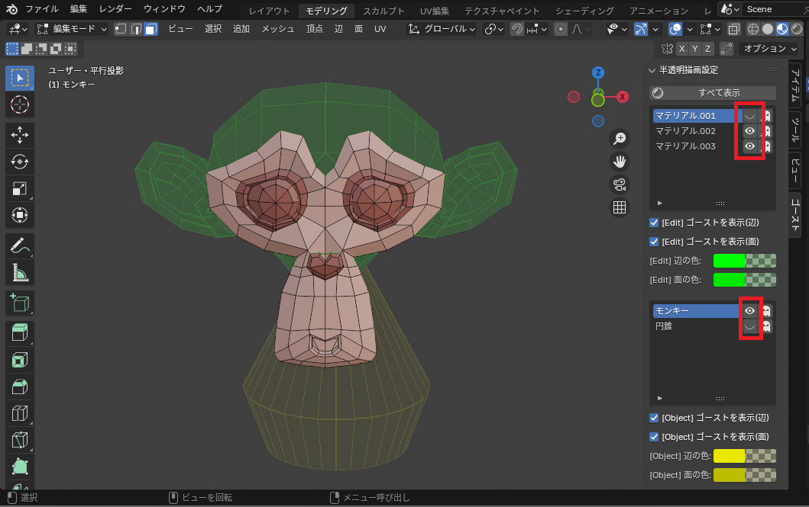

# Blender Add-on: Ghost Mesh

Ghost Meshは編集モードで面を非表示にした際に、メッシュを半透明で表示するアドオンです。

半透明表示でオブジェクトの形状を確認しながら編集したい人向けのアドオンとなっています。

## インストール

詳細は [INSTALL](docs/INSTALL.md) を確認してください。

## 使用例
「表示マテリアルの選択」パネルで編集したいマテリアル単位で表示/非表示（半透明）を切り替えることができます。

「表示マテリアルの選択」で編集したいマテリアル以外の表示/非表示ボタンをクリックする。（画像の赤枠部分）

「表示のマテリアル」の右にあるボタン（ゴーストのアイコン）をクリックすることで半透明表示、非表示を切り替えます。

## 機能

### 表示マテリアルの選択

- 「すべて表示」

  非表示の頂点、辺、面を表示します。

- 「マテリアル」選択

  指定したマテリアルが割り当てられたメッシュのみ表示し、それ以外を半透明（非表示）にします。
  - 「表示/非表示」ボタンで対象の表示/非表示を切り替えます。
  - 「ゴースト」ボタンで非表示時に半透明表示するか、表示しないかを切り替えます。

- 「ゴーストを表示」

   チェックで半透明表示をオンにします。チェックを外すと非表示になります。

- 「辺の色」

  半透明時の辺の色を設定します。

- 「面の色」

  半透明時の面の色を設定します。
