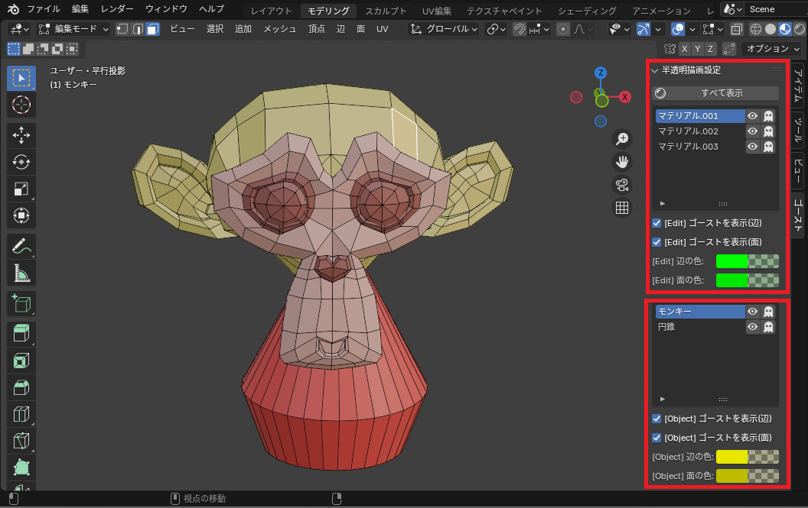

# Blender Add-on: Ghost Mesh

Ghost Meshはオブジェクトの編集モードで頂点、辺、面を隠した際に、非表示となったメッシュを半透明で表示するアドオンです。

■使用前（ゴーストを表示にチェックなし）

■使用後（ゴーストを表示にチェック）

### 使用例
メッシュを編集する際に、編集したいメッシュの頂点、辺、面が動かないように対象以外を非表示にすることができます。
「表示マテリアルの選択」パネルで編集したいマテリアルのみ表示することができます。

対象マテリアル以外が半透明となって編集しやすくなります。
* 「表示マテリアルの選択」で「顔のマテリアル」ボタンを押下します。

特定のマテリアルの半透明表示を非表示に変更できます。
* 「髪の毛のマテリアル」の右にあるボタン（ゴーストのアイコン）をクリックします。

