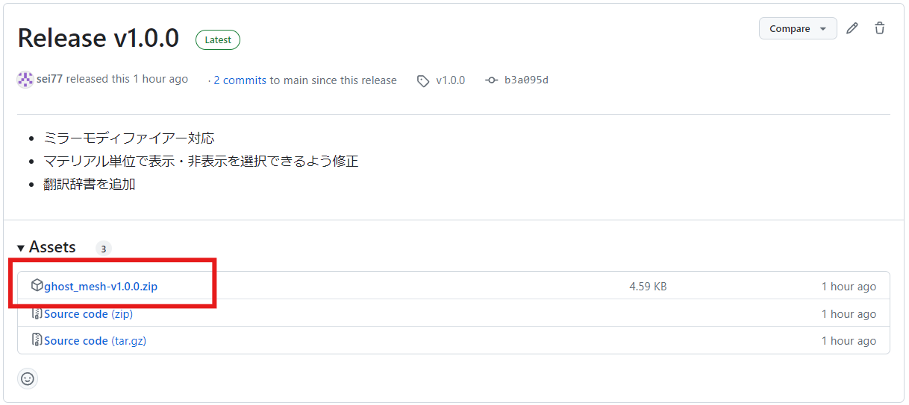

# インストール方法（エクステンションの場合）

- 以下のReleaseリンクから最新バージョンのZipファイルをダウンロードする

  [Release](https://github.com/sei77/ghost_mesh/releases)

  

※「オンラインエクステンションのインストールや更新はインターネットアクセスが必要です.」と表示された場合は、「Allow Onnline Access」を選択してオンラインアクセスを許可する必要があります。

- Blenderメニューの「編集」→「プリファレンス」から「エクステンションを入手」を選択する。
  Blenderプリファレンスのダイアログに上記でダウンロードしたZipファイルをドラッグ＆ドロップする。

  

- 「ディスクからインストール」のダイアログが表示されたら「OK」をクリックする

  

- Ghost Meshが表示されることを確認してプリファレンスを閉じる。
  （アドオンがうまく認識しない場合は、Blenderを再起動してください）

  

- 3Dビューポートで編集モードに切り替え、ナビゲーションメニューに「ゴースト」が表示されていればアドオンが動作しています。
　（マテリアルが割り当てられた面を非表示にすると半透明で描画されます）

