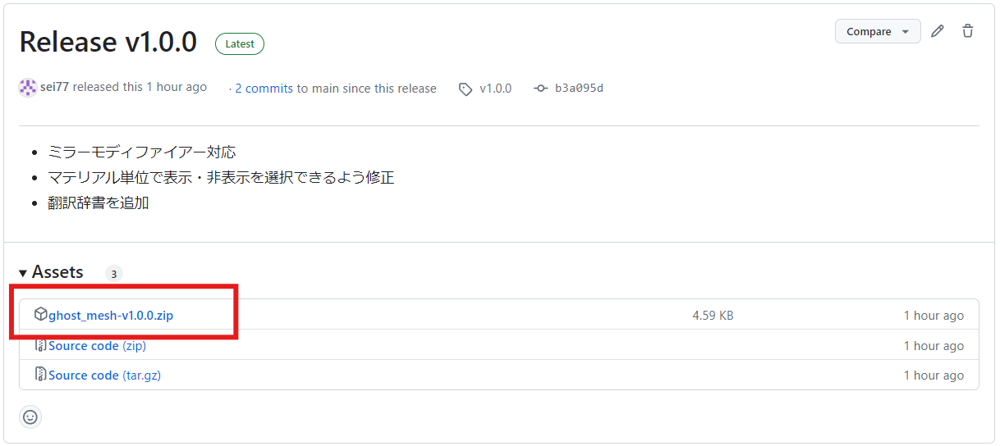
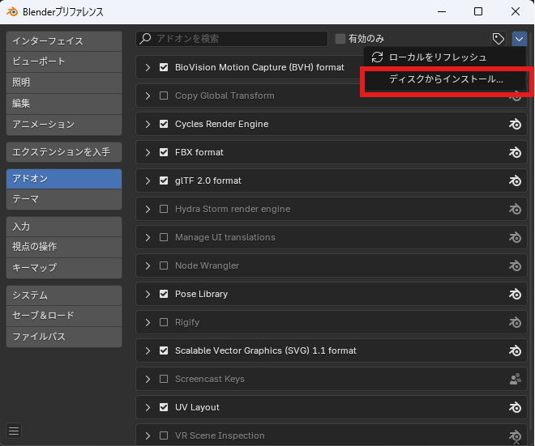
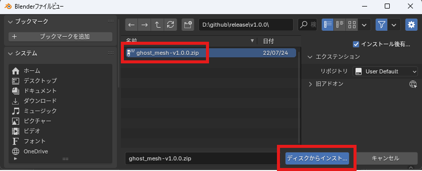
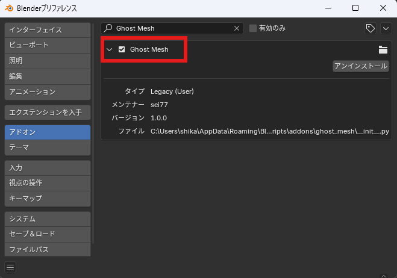

# インストール方法

- 以下のReleaseリンクから最新バージョンのZipファイルをダウンロードする

  [Release](https://github.com/sei77/ghost_mesh/releases)

  

- Blenderメニューの「編集」→「プリファレンス」から「アドオン」を選択する。
  右上の下矢印プルダウンから「ディスクからインストール」をクリックする。

  

- ダウンロードしたアドオンのZipファイルを選択して、「ディスクからインストール」をクリックする

  

- Ghost Meshにチェックが入っていることを確認してプリファレンスを閉じる。
  （アドオンがうまく認識しない場合は、Blenderを再起動してください）

  

- 3Dビューポートで編集モードに切り替え、ナビゲーションメニューに「ゴースト」が表示されていればアドオンが動作しています。
　（マテリアルが割り当てられた面を非表示にすると半透明で描画されます）

